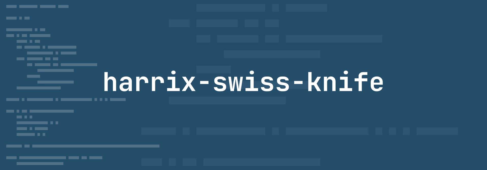
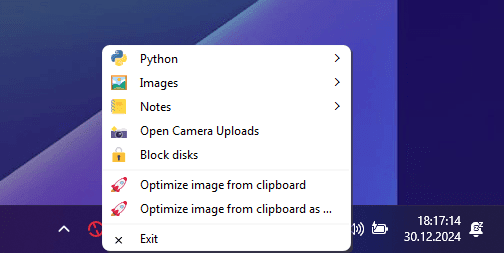

# harrix-swiss-knife



This is a **personal** project tailored to **specific personal** tasks.

This project provides an application with a context menu in the system tray, featuring mini-programs designed to automate specific personal tasks. The project is intended for use on Windows.



_Figure 1: Screenshot_

## List of commands

- **Python**
  - New Rye project in Projects
  - New Rye project in …
  - Sort classes, methods, functions in PY files
  - Sort classes, methods, functions in one PY file
- **Images**
  - Optimize images
  - Optimize images (high quality)
  - Optimize images in …/temp
  - Optimize images in … and replace
  - Optimize one image
  - Clear the folder `optimized_images`
  - Clear the folder `images`
  - Open the folder `optimized_images`
  - Open the folder `images`
- **Notes**
  - New note
  - New note with images
  - New diary note
  - New diary note with images
  - New dream note
  - New article
- **Dev**
  - Get the list of items from this menu
  - Open config.json
- Open Camera Uploads
- Block disks
- Optimize image from clipboard
- Optimize image from clipboard as …
- Exit

## Deploy on an empty machine (Windows)

- Install [Rye](https://rye.astral.sh) ([Установка и работа с Rye (Python) в VSCode](https://github.com/Harrix/harrix.dev-articles-2024/blob/main/rye-vscode-python/rye-vscode-python.md)), Node.js, VSCode (with python extensions), Git.

- Clone project:

  ```shell
  mkdir C:/GitHub
  cd C:/GitHub
  git clone https://github.com/Harrix/harrix-swiss-knife.git
  ```

- Open the folder `C:/GitHub/harrix-swiss-knife` in VSCode.

- Open a terminal `Ctrl` + `` ` ``.

- Run `rye sync`.

- Run `npm i`.

- Copy `ffmpeg.exe` to the project folder `C:/GitHub/harrix-swiss-knife`. For example, from `ffmpeg-master-latest-win64-gpl.zip` (<https://github.com/BtbN/FFmpeg-Builds/releases>).

- Open `src\harrix-swiss-knife\main.py` and run.

After you can run the script from a terminal (or VSCode):

```shell
c:/GitHub/harrix-swiss-knife/.venv/Scripts/pythonw.exe c:/GitHub/harrix-swiss-knife/src/harrix_swiss_knife/main.py
```

## CLI commands

CLI commands after installation.

- `rye self update` — update Rye itself.
- `rye sync --update-all` — update all project libraries.
- `isort .` — sort imports.
- `rye fmt` — format the project's Python files.
- `rye lint` — lint the project's Python files.
- `rye fetch 3.13` + `rye pin 3.13` + `rye sync` — switch to a different Python version.

## Add file to a resource file

Add files (pictures, etc.) to the `src\harrix_swiss_knife\assets` folder.

In the file `resources.qrc` add line for example `<file>assets/logo.svg</file>`:

```xml
<?xml version="1.0" encoding="UTF-8"?>
<RCC>
    <qresource prefix="/">
        <file>assets/logo.svg</file>
    </qresource>
</RCC>
```

Generate `resources_rc.py`:

```shell
pyside6-rcc src\harrix_swiss_knife\resources.qrc -o src\harrix_swiss_knife\resources_rc.py
```

## Create a shortcut

Example path for a shortcut:

```shell
C:/GitHub/harrix-swiss-knife/.venv/Scripts/pythonw.exe c:/GitHub/harrix-swiss-knife/src/harrix_swiss_knife/main.py
```
