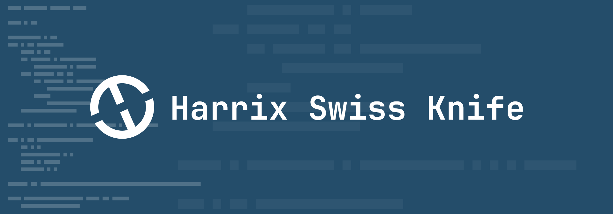
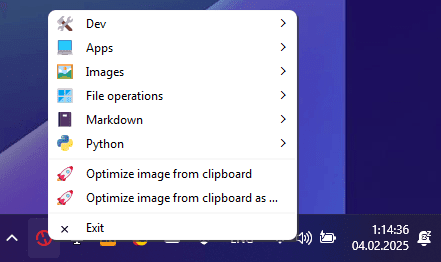

# harrix-swiss-knife



This is a **personal** project tailored to **specific personal** tasks.


This project provides an application with a context menu in the system tray, featuring mini-programs designed to automate specific personal tasks. The project is intended for use on Windows.



_Figure 1: Screenshot_

## List of commands

- **Dev**
  - Get the list of items from this menu
  - Open config.json
- **Images**
  - Optimize images
  - Optimize images (high quality)
  - Optimize images in … and replace
  - Optimize images in …/temp
  - Optimize one image
  - Clear folders images
  - Open the folder images
  - Open the folder optimized_images
- **Markdown**
  - New dream note
  - New diary note with images
  - New diary note
  - New article
  - New note with images
  - New note
  - Quotes. Add author and title
  - Get a list of movies, books for web
  - Add image captions in one MD
  - Add image captions in …
  - Sort sections in one MD
  - Sort sections in …
- **File operations**
  - Moves and flattens files from nested folders
  - Check featured_image.* in …
  - Check featured_image.*
  - Block disks
  - Open Camera Uploads
  - Tree view of a folder (ignore hidden folders)
  - Tree view of a folder
- **Python**
  - New uv project in …
  - New uv project in Projects
  - isort, ruff format, sort in PY files
  - Sort classes, methods, functions in one PY file
  - Sort classes, methods, functions in PY files
  - Extracts list of funcs to a MD list from one PY file
  - Generate MD documentation from one PY file
- Optimize image from clipboard
- Optimize image from clipboard as …
- Exit

## Deploy on an empty machine (Windows)

- Install [uv](https://docs.astral.sh/uv/) ([Установка и работа с uv (Python) в VSCode](https://github.com/Harrix/harrix.dev-articles-2025/blob/main/uv-vscode-python/uv-vscode-python.md)), Node.js, VSCode (with python extensions), Git.

- Clone project:

  ```shell
  mkdir C:/GitHub
  cd C:/GitHub
  git clone https://github.com/Harrix/harrix-swiss-knife.git
  ```

- Open the folder `C:/GitHub/harrix-swiss-knife` in VSCode.

- Open a terminal `Ctrl` + `` ` ``.

- Run `uv sync`.

- Run `npm i`.

- Copy `ffmpeg.exe` to the project folder `C:/GitHub/harrix-swiss-knife`. For example, from `ffmpeg-master-latest-win64-gpl.zip` (<https://github.com/BtbN/FFmpeg-Builds/releases>).

- Open `src\harrix-swiss-knife\main.py` and run.

After you can run the script from a terminal (or VSCode):

```shell
c:/GitHub/harrix-swiss-knife/.venv/Scripts/pythonw.exe c:/GitHub/harrix-swiss-knife/src/harrix_swiss_knife/main.py
```

## CLI commands

CLI commands after installation.

- `uv self update` — update uv itself (sometimes you need to call twice).
- `uv sync --upgrade` — update all project libraries.
- `isort .` — sort imports.
- `ruff format` — format the project's Python files.
- `ruff check` — lint the project's Python files.
- `uv python install 3.13` + `uv python pin 3.13` + `uv sync` — switch to a different Python version.

## Add file to a resource file

Add files (pictures, etc.) to the `src\harrix_swiss_knife\assets` folder.

In the file `resources.qrc` add line for example `<file>assets/logo.svg</file>`:

```xml
<?xml version="1.0" encoding="UTF-8"?>
<RCC>
    <qresource prefix="/">
        <file>assets/logo.svg</file>
    </qresource>
</RCC>
```

Generate `resources_rc.py`:

```shell
pyside6-rcc src\harrix_swiss_knife\resources.qrc -o src\harrix_swiss_knife\resources_rc.py
```

## Create a shortcut

Example path for a shortcut:

```shell
C:/GitHub/harrix-swiss-knife/.venv/Scripts/pythonw.exe c:/GitHub/harrix-swiss-knife/src/harrix_swiss_knife/main.py
```
